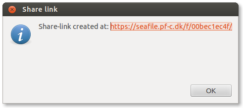

# README #

A script to create Seafile share-links from the command line plus a
wrapper that allows you to use it from Nautilus.

This functionality could probably be done in a better way, and be installed
along with the Seafile client itself - but until then, you can use these two
scripts.

The Nautilus-functionality requires `nautilus-script-manager` or
`nautilus-scripts-manager` as it is intended to be used as a
[Nautilus script ](http://g-scripts.sourceforge.net/) (You could also
consult [Ubuntus Howto](https://help.ubuntu.com/community/NautilusScriptsHowto) )

**Version:** 0.3

I will call it 1.0 when somebody (other than me) reports it working ;-)
See contact info at the bottom.

## How do I set it up? ##

### Prerequisites ###

The install-script checks for the prerequisites.

`seafile-share-link` requires that `sqlite3` is installed.
It is used to access the Seafile-config-files. It also needs `curl`
to access the Seafile REST-API.

`nautilus-seafile-share-link` is meant to be called as a "Nautilus Script",
and requires `nautilus-script-manager` or `nautilus-scripts-manager`.
Finally `zenity` is used for the dialog boxes. Chances are good that you
have 'zenity' installed if you have Nautilus.

### Installation ###

    sudo ./install.sh

The nautilus-script is installed in `/usr/share/nautilus-scripts` and needs to
be "activated" for each user using "nautilus-scripts-manager" or "nautilus-script-manager".
The install-script will inform you about this.

### Example - command line ###

    $ cd /home/aba/Seafile/pfc/AroFotos/portraits
    $ seafile-share-link kislas.jpg
    Share-link created at: https://seafile.pf-c.dk/f/12bb311a30/

or with full path:

    $ seafile-share-link /home/aba/Seafile/pfc/AroFotos/portraits/kislas.jpg
    Share-link created at: https://seafile.pf-c.dk/f/12bb311a30/

### Example - Nautilus ###

After right-click on "build.log":

### Tested on ###

  * Ubuntu 12.04, Seafile client version 4.2.4, Seafile Server version 4.2.2

## Contact

Author: Anders Bandholm

Email: 2015 at-sign d7.dk (after 2015: replace 2015 with present year)

*I liked it when you could just post your email without getting spammed...*
